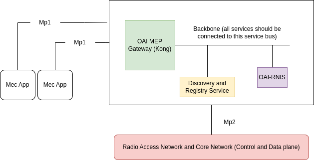

# Lab2A

### Simulated MEC Platform 
* This MEC Platform will run on single machine spec 
* the VM used here is MEC-Platform Ubuntu Desktop Image
* Please make sure you stop/shutdown any other Virtual Machines  ( you can keep it running, but it will slow down the machine )

* username: droot 
* password: -nil-

  

* The Discovery and Registry Service (DaRS) is the heart of MEC platform. It exposes REST API for mp1 inferace to:

1. Register a new MEC service (post request)
2. Discover hosted MEC services (get request)
3. Filter hosted MEC services based on service-type  (get request)
4. Delete a hosted MEC service (delete request)


# Step 

* Clone the This REPO 
* Navigate to oic-mep 
* Download Docker Images ( Standalone )
* Start the MEC Platform ( MEP )


```sh
cd $HOME 

git clone https://github.com/stv707/mec_labs.git

cd $HOME/mec_labs/oai-mep/

sudo docker-compose -f ci-scripts/docker-compose.yaml up -d
```
>> the images already been downloaded.


# Step 
* Add ip/name  172.29.248.3 oai-mep.org  to /etc/host 

```sh
sudo vim /etc/hosts 
172.29.248.3 oai-mep.org 

```

# Step 


```sh

```

# Step 

```sh

```

# Step

```sh


```

# Step


```sh

```

# Step

```sh

```

# Step


```sh

```


# Step

```sh

```

# Step


```sh

```

END