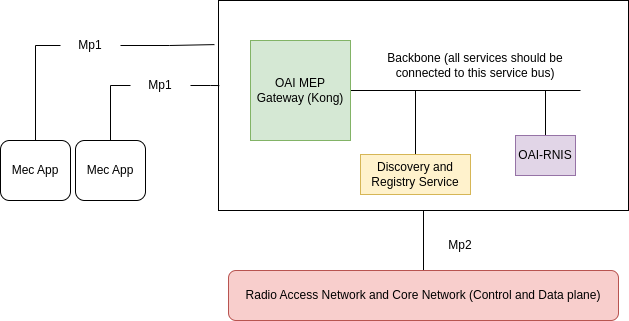
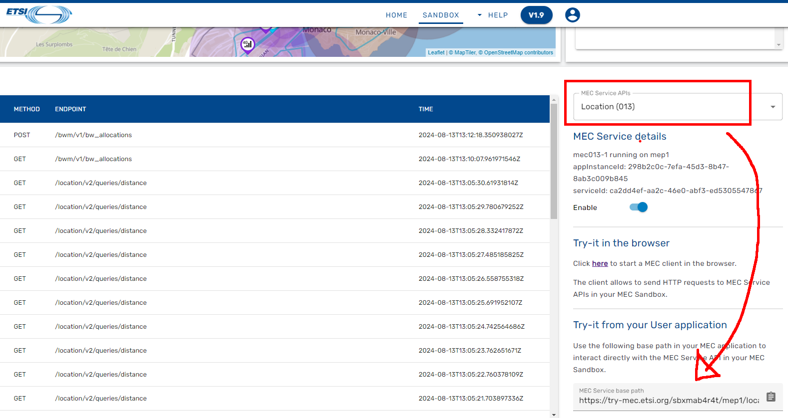

# Lab2A

### Simulated MEC Platform 
* This MEC Platform will run on single machine spec 
* the VM used here is [ MEC-Platform Ubuntu ] Desktop Image
* Please make sure you stop/shutdown any other Virtual Machines  ( you can keep it running, but it will slow down the machine )

* username: droot 
* password: -nil-

  

* The Discovery and Registry Service (DaRS) is the heart of MEC platform. It exposes REST API for mp1 inferace to:

1. Register a new MEC service (post request)
2. Discover hosted MEC services (get request)
3. Filter hosted MEC services based on service-type  (get request)
4. Delete a hosted MEC service (delete request)


# Step 

* Clone the This REPO 
* Navigate to oic-mep 
* Download Docker Images ( Standalone )
* Start the MEC Platform ( MEP )


# Step 
* Add ip/name  172.29.248.3 oai-mep.org  to /etc/host 

```sh
sudo vim /etc/hosts 
172.29.248.3 oai-mep.org 

```


```sh
cd $HOME 

git clone https://github.com/stv707/mec_labs.git

cd $HOME/mec_labs/oai-mep/

docker-compose -f ci-scripts/docker-compose.yaml up -d
```


# Step 
* Verify the MECP is running 

```sh

docker ps 

docker-compose -f ci-scripts/docker-compose.yaml ps 

```
>> All container must show healthy 


# Step 
* View the MEC Platform API and Register new Service and Verify the new Service
* If you make any mistake, bring down the Containers and Bring them up again, this will reset the containers


1. access http://oai-mep.org/service_registry/v1/ui


2. in the swagger API, access GET /discover and select Try-it-out 

3. execute to view the list of service registered in MEC Platform 
    - your respons should be empty but CODE 200

4. Clear the execution 

5. go POST /register > Select Try Out > Clear the Sample JASON and copy and paste below JSON 

```sh 
{
  "description": "description",
  "endpoints": [
    {
      "description": "description",
      "method": "GET",
      "name": "name",
      "parameters": [
        {
          "name": "input_file",
          "type": "binary"
        }
      ],
      "path": "/transcode"
    }
  ],
  "host": "oai-mep.org",
  "name": "video-image-encoder",
  "path": "/v1/video",
  "port": 7898,
  "sid": "sid",
  "type": "AVEncoding"
}
```

6. Verify the RETRUN CODE is 201 ( Service Added Correctly )

7. Try to explore all other API 

>> ALL this API are MEC PLATFORM Spec by ETSI 
>> any MEC Vendor will have all this as per ETSI Spec according to your application service or requirements 


# Step

* Explore GET /discover 

* Explore GET /discover/{serviceType}

* Explore POST /register

* DELETE /register/{ServiceID}

# END 


## LAB2B - Try-MEC API
# Step
* MEC Sandbox is an interactive environment that enables users to learn & experiment with ETSI MEC Service APIs. These standardized RESTful APIs are targeted towards MEC application developers to expose the value added services offered by MEC, including real time access to network and context information, as well as location awareness. The design principles for developing the APIs have also been specified in ETSI GS MEC 009, along with http methods, templates, conventions and patterns. The MEC service APIs are available in YAML and JSON format at https://forge.etsi.org, presented via OpenAPI compliant descriptions.

* MEC Sandbox provides the user with a choice of scenarios combining different network technologies (4G, 5G, Wi-Fi) and terminal types. Combining these assets in a geolocated environment, a user can gain hands-on experience on the behavior and capabilities of the Location (MEC013), Radio Network Information (MEC012), WLAN Information (MEC028), Edge Platform Application Enablement (MEC011) and Application Mobility (MEC021) service APIs. Such contextual information can offer significant differential performance for edge based MEC applications.


* You will explore more API at https://try-mec.etsi.org/

* Before you login, you need a GitHub Account ( Register for free )


* Once you signed in, a Sandbox will run  ( or you may need to start the SandBox )

* Select a Network  e.g: 4g-5g-macro-v2x 

* Select MEC APIs 
 - Radio Network Information [ ETSI 012 ]
 - enable this 
 - explore the Request using the Try-it in the browser 

* You can access https://mecwiki.etsi.org/index.php?title=MEC_Sandbox_Help#UE_Types to get more information on how to use/try this platform

### Step : Navigate the try-mec with Swagger UI

1. Setup the SandBox as per this settings: 


2. Find the ID of UE: 
  


3. Use the swagger UI ( ETSI GS MEC 013 - Location API )


4. In the Swagger UI : Navigate to GET /queries/users and select Try it out and select add the UE ID 


5. Examine the Response Body


### Step : Try access the APi from Application Point of View

1. SSH to ssh.cognitoz.my with your username and password as per table below

| Username | StuNo | Student Name             |
|----------|--------------------------|-----|
| stu1     | 01 |Chong Siew Kwee          |
| stu2     | 02 |Koay Wei Kheng           |
| stu3     | 03 |Larsen Bautista Barcelon |
| stu4     | 04 |Lee Hao Yi               |
| stu5     | 05 | Liew Chee Seng          |
| stu6     | 06 | Pang Chee Wai           |
| stu7     | 07 | Shahrin Md Zin          |
| stu8     | 08 | Sharen Bin Hassim       |
| stu9     | 09  |Wong Choon Hon          |

2. Example: 
```sh 

ssh stuX@ssh.cognitoz.my 

```

3. While you are at https://try-mec.etsi.org/ , fetch the base API URL 



4. In your prompt , navigate to lab2 
```sh 
cd $HOME 

cd $HOME/mec_labs/lab2/
```

5. Run the shell script ( mecpapi1.sh ), and follow the prompt 
```sh 
. mecapi1.sh 
```

6. Adjust the UE Settings as per below


7. Run second shell script ( mecapi2.h ), and follow the prompt 
```sh 
. mecapi2.sh
```


## LAB2C - CAMARA API Example

1. navigate to https://developer.orange.com/apis/camara-sandbox-device-location-retrieval-orange-lab/getting-started

>> Orange S.A. is a French multinational telecommunications company. It has 266 million customers worldwide and employs about 89,000 people or more in France and 59,000 people worldwide. In 2023, the group had a revenue of approximately €43 billion. The company's head office is located in Issy-les-Moulineaux, in the southwestern suburban area of Paris City.

2. In the Page, read thru and the Getting Started on the CAMARA API offering/


END