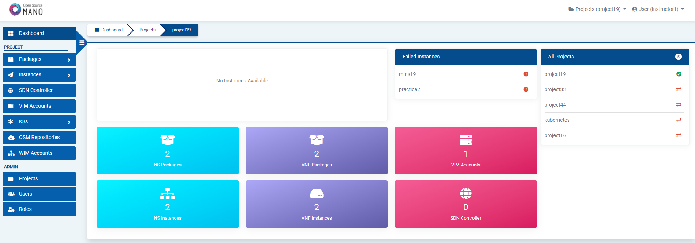
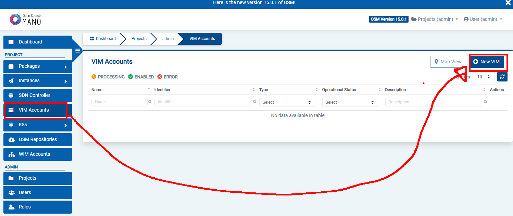
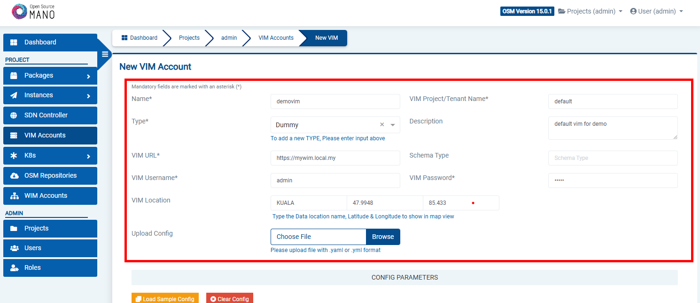
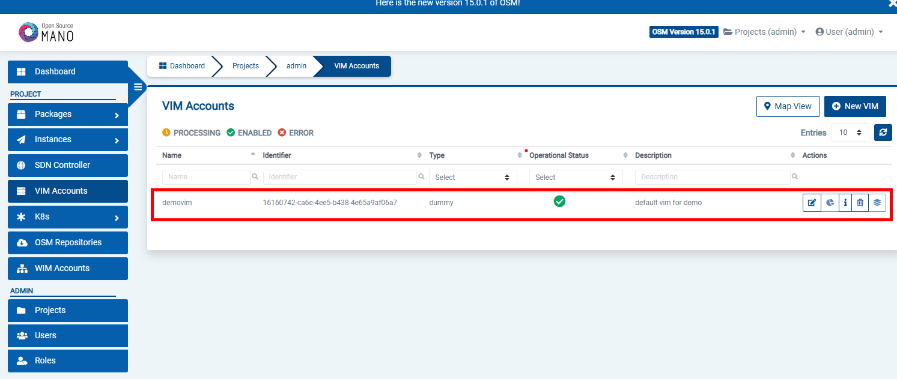
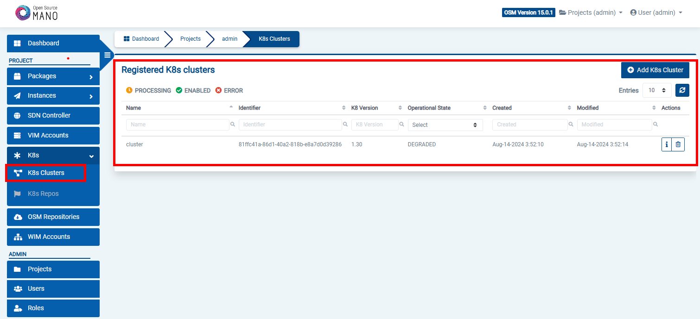

# Lab 3B : MANO with Kubernetes

* VM Machine: MANOv15-base
* power on this machine ( make sure you turn off other machines )

# Step 
* rename the machine 
```sh 
sudo hostnamectl hostname osmXX 
```
>> XX is your student no. 
>> Logout and Login to verify name change

# Step 
* Install OSM (standard installation)

```sh
wget https://osm-download.etsi.org/ftp/osm-15.0-fifteen/install_osm.sh

chmod +x install_osm.sh

./install_osm.sh
```
>> If there is a prompt, read it and press Y to continue
>> it will take 7 minute 42seconds to install ETSI MONA ( Standard installation )
>> Even the installation is done, the POD ( containers are still starting )

# Step 

* in the shell run the following to verify the installation of ETSI MANO

```sh
kubectl get all -n osm

kubectl -n osm get pods
```
>> Make sure all Pods are Running ( will take some time )
>> it will take 6 minute or less 

# Step 
* You can access to the UI in the following URL (user:admin, password: admin): http://1.2.3.4, replacing 1.2.3.4 by the IP address of your VM.





# Step
* Install OSM client

```sh
sudo snap install osmclient

```
# Step
* Create a Dummy VIM called demovim 
* Name it demovim







# Step
* Now, you will download the kubeconfig from Cloud Kubernetes

```sh
scp stuX@ssh.cognitoz.my:/home/stuX/.kube/config .
stuX@ssh.cognitoz.my's password: ( GIVEN IN CLASS )
```
>> replace the stuX with your student number


# Step
* Add K8s cluster to OSM MANO 

```sh

osm k8scluster-list

osm k8scluster-add --creds config --version '1.30' --vim demovim --description "My K8s cluster" --k8s-nets '{"net1": "vim-net"}' cluster

osm k8scluster-list

osm k8scluster-show cluster

```
# Step
* Verify the k8s cluster been added to OSM MANO 



# Step
* You might need to add some repos from where to download helm charts required by the KNF

```sh
osm repo-add --type helm-chart --description "Bitnami repo" bitnami https://charts.bitnami.com/bitnami

osm repo-add --type helm-chart --description "Cetic repo" cetic https://cetic.github.io/helm-charts

osm repo-add --type helm-chart --description "Elastic repo" elastic https://helm.elastic.co

osm repo-list

osm repo-show bitnami
```

# Step
* Once the cluster is attached to your OSM, you can work with KNF in the same way as you do with any VNF. For instance, you can onboard the example below of a KNF consisting of a single Kubernetes deployment unit based on OpenLDAP helm chart.

```sh
cd $HOME 

git clone --recursive https://osm.etsi.org/gitlab/vnf-onboarding/osm-packages.git

cd osm-packages

osm nfpkg-create openldap_knf

osm nspkg-create openldap_ns

```

# Step
* You can instantiate two NS instances:

```sh
osm ns-create --ns_name ldap --nsd_name openldap_ns --vim_account demovim 
```

```sh 
osm ns-create --ns_name ldap2 --nsd_name openldap_ns --vim_account demovim --config '{additionalParamsForVnf: [{"member-vnf-index": "openldap", additionalParamsForKdu: [{ kdu_name: "ldap", "additionalParams": {"replicaCount": "2"}}]}]}'
```


# Step
* Check that both operations are marked as completed:

```sh
osm ns-op-list ldap
osm ns-op-list ldap2
```

# Step
* Head to Cloud Kubernetes and verify OSM/MANO have deployed 2 KNF to Kubernetes 

```sh
ssh stuX@ssh.cognitoz.my


kubectl get ns 

kubectl get pod -n  < UUID-MANO >

kubectl get all -n  < UUID-MANO >

```
END