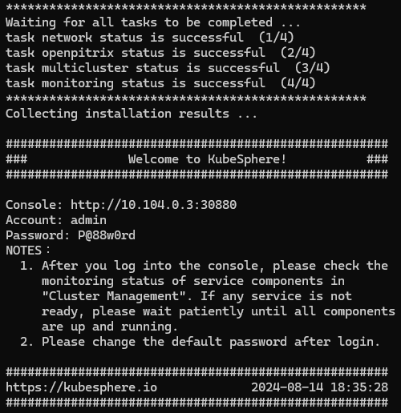

# Lab 4A 

# Step 

* Installing KubeSphere on Kubernetes

* As part of KubeSphere's commitment to provide a plug-and-play architecture for users, it can be easily installed on existing Kubernetes clusters. More specifically, KubeSphere can be deployed on Kubernetes either hosted on clouds (for example, AWS EKS, QingCloud QKE and Google GKE) or on-premises. This is because KubeSphere does not hack Kubernetes itself. It only interacts with the Kubernetes API to manage Kubernetes cluster resources. In other words, KubeSphere can be installed on any native Kubernetes cluster and Kubernetes distribution.


# Step 
* login to remote shell 
>> ssh.cognitoz.my with your username 

```sh
ssh stuX@cognitoz.my
```
>> replace X with your student number 


# Step 
* run the following to install KubeSphere 

```sh
kubectl apply -f https://github.com/kubesphere/ks-installer/releases/download/v3.4.1/kubesphere-installer.yaml
```

```sh
kubectl apply -f https://github.com/kubesphere/ks-installer/releases/download/v3.4.1/cluster-configuration.yaml
```


# Step 
* The above step will install kubesphere in Cloud Kubernetes
* to monitor the installation, run the following command
```sh
kubectl logs -n kubesphere-system $(kubectl get pod -n kubesphere-system -l 'app in (ks-install, ks-installer)' -o jsonpath='{.items[0].metadata.name}') -f

```
>> The installation may take a while, please wait until KubeSphere is fully installed
>> Wait until you get the following output: 

* 

*  
>> Note the UserName and Password 
>> you can control+c to stop the installation monitoring 

# Step 
* once the installation is finished, set the access to public ip address 
* This will be the PUBLIC IP generated by the LoadBalancer. 

```sh
kubectl get all -n kubesphere-system

kubectl patch service ks-console -n kubesphere-system -p '{"spec": {"type": "LoadBalancer"}}'

kubectl get all -n kubesphere-system

kubectl get svc -n kubesphere-system --watch
```
>> Wait until you get PUBLIC IP Address for service/ks-console ( Pending changes to IP )
>> You can control+c to stop the watch 

# Step
* Access the KubeSphere GUI at the Public IP address you generated

* Open a web Browser and use http://PUBLIC_IP 
* refer to the default username and password to login 


END