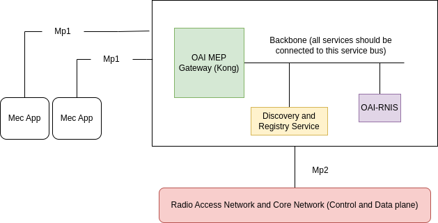

<table style="border-collapse: collapse; border: none;">
  <tr style="border-collapse: collapse; border: none;">
    <td style="border-collapse: collapse; border: none;">
      <a href="http://www.openairinterface.org/">
         
         </img>
      </a>
    </td>
    <td style="border-collapse: collapse; border: none; vertical-align: center;">
      <b><font size = "5">OpenAirInterface Multi-access Edge Computing Platform (MEP) </font></b>
    </td>
  </tr>
</table>

Multi-access Edge Computing platforms (MEP) is a part of the ETSI MEC architecture. Our implementation of MEC platform allows different MEC applications to discover MEP hosted services and register their own service which can be discovered by other MEC applications. 

OAI-MEP follows ETSI GS MEC 003 V3.1.1. MEC appications communicate with MEP via `mp1` interface and applications hosted at MEP communicates with Radio Access Network (RAN) and Core Network (CN) components via `mp2` interface.

This repository is a **work in progress** at the moment MEP only provides service discovery and registry for other MEC applications via `mp1` interface. We have implemented MEC [Radio Network Information Service (RNIS)](https://gitlab.eurecom.fr/oai/orchestration/oai-mec/oai-rnis), ETSI GS MEC 012. It collects the radio network information via `mp2` interface. We are working on adding traffic rules control service via communicating with [Policy Control Function](https://gitlab.eurecom.fr/oai/cn5g/oai-cn5g-pcf). 


**TABLE OF CONTENTS**

1.  [Architecture](#1-architecture)
2.  [How to use](#2-how-to-use)
4.  [How to Contribute](#3-how-to-contribute)
5.  [Leave a Feedback or Ask Questions](#4-leave-a-feedback-or-ask-questions)
6.  [Authors](#5-authors)


## 1. Architecture

Below is the architecture of MEP. OAI-MEP Gateway is the entrypoint and takes care of routing the `mp1` traffic to the right service. We are using [kong](https://konghq.com/) as reverse proxy. 



The Discovery and Registry Service (DaRS) is the heart of MEC platform. It exposes REST API for `mp1` inferace to:

1. Register a new MEC service (`post` request)
2. Discover hosted MEC services (`get` request)
3. Filter hosted MEC services based on `service-type`  (`get` request) 
4. Delete a hosted MEC service (`delete` request)

[OAI-RNIS](https://gitlab.eurecom.fr/oai/orchestration/oai-mec/oai-rnis) is a seperate repository. In this repository there is only the code of discovery and registry service.


## 2. How to Use

For users of MEP we recommend that you use docker containers for running MEP services. 

Clone the project

```shell
git clone https://gitlab.eurecom.fr/oai/orchestration/oai-mec/oai-mep.git
```

### 2.1 Build Container Images (Optional)

We are using official docker images of mongodb, kong and postgres (needed by kong). You can pull the image from our [official repository](https://hub.docker.com/r/oaisoftwarealliance/oai-mep) or build the docker image for MEP registry and discovery service in case you made any changes in the code. If you don't pull the images in this step, the docker-compose file will pull the images for you. 

To build the image

```shell
docker build -t oaisoftwarealliance/oai-mep:latest -f docker/Dockerfile.alpine --no-cache .
```

### 2.2 Start the MEP and Its Dependencies

To start all the MEP services you can use our testing docker-compose

**Note**: MongoDB, which is a OAI-MEP-REGISTRY dependency requires a CPU with AVX instruction set support.

```shell
docker-compose -f ci-scripts/docker-compose.yaml up -d
```

To see all the services are healthy and once they are healthy you can move to the next step 

```shell
docker-compose -f ci-scripts/docker-compose.yaml ps -a
```

A good installation will look like below,

```
NAME                 COMMAND                  SERVICE              STATUS              PORTS
migeration-tmp       "/docker-entrypoint.…"   kong-migration       exited (0)          
oai-mep-gateway      "/docker-entrypoint.…"   oai-mep-gateway      running (healthy)   8000/tcp, 8443-8444/tcp, 0.0.0.0:32807->80/tcp, :::32807->80/tcp, 0.0.0.0:32806->8001/tcp, :::32806->8001/tcp
oai-mep-gateway-db   "docker-entrypoint.s…"   oai-mep-gateway-db   running (healthy)   5432/tcp
oai-mep-registry     "oai_mep"                oai-mep-registry     running (healthy)   
oai-registry-db      "docker-entrypoint.s…"   mongodb              running (healthy)   0.0.0.0:27017->27017/tcp, :::27017->27017/tcp
```

Finally you need to configure the FQDN of `oai-mep-gateway` or kong instance in your dns or `/etc/hosts`. Add the below line in your `/etc/hosts` else MEP will not be able to route the `mp1` traffic to the right service hosted at the mep.

```shell
172.29.248.3 oai-mep.org  
```

You can access the northbound swagger api of registry and discovery service here http://oai-mep.org/service_registry/v1/ui You can try the example defined in swagger. 

To read the logs of the services

```shell
#registry service
docker logs oai-mep-registry
#gateway
docker logs oai-mep-gateway
```

To stop all the containers,

```shell
docker-compose -f ci-scripts/docker-compose.yaml down -t2
```

### 2.3 For developers

If you want to make any changes in registry and discovery service you can install the service using below commands

Pre-requisite: python +3.8, virtualenv(optional), Ubuntu 20 (focal). 

**Note**: Only tested in linux at the moment

Clone the project

```shell
git clone https://gitlab.eurecom.fr/oai/orchestration/oai-mec/oai-mep.git
```

**Optional**: If you want to create a virtual python environment for testing then you can use `virtualenv` or `pyenv`. Here is an example with virtualenv to create a virtual python environment for testing/development. 

```shell
cd oai-mep
apt-get install virtualenv
virtualenv -p python3 venv
# to start the virtual environment
source venv/bin/activate
# to get out of the environment 
deactivate
```

Installing MEP

```shell
cd oai-mep/src
pip install .
#if you want to edit the code while running you can use -e
pip install -e .
```

### 2.3.1 Configuration

The config parameters are written in [configuration.yaml](./etc/configuration.yaml). The file is python jinja2 template. At the runtime parameters are fetched from environment variable to create the file. You can set the parameters as environment variables or fill the information in the configuration file and set the environment variable `MOUNT_CONFIG` to `yes`. You can find a sample [configuration.yaml](./etc/configuration.sample.yaml) is in `./etc` repository. 

Before starting `oai_mep` process, below services should be running:

- mongodb instance, in sample configuration file it is configured to `localhost:27017`
- kong instances (better to use our [docker-compose](./ci-scripts/docker-compose.yaml) )
- (Very important) Configure the FQDN of `oai-mep-gateway` or kong instance in your dns or `/etc/hosts`. Add the below line in your `/etc/hosts` else MEP will not be able to route the `mp1` traffic to the right service.

We will bind registry and discovery service on `172.29.248.1` (the docker bridge) this way kong will be properly able to route the traffic


```shell
# to mount the configuration file
#current directory is oai-mep/
export MOUNT_CONFIG=yes
#set the configuration file to etc/configuration.sample.yaml, you need to set the full path
export CONFIG_FILE=<your-parent-directory>/etc/configuration.sample.yaml
# optional if you want to use our docker-compose kong instances and mongodb
docker-compose -f ./ci-scripts/docker-compose.yaml up -d mongodb oai-mep-gateway
# start the mep
oai_mep
```

Configure the FQDN of `oai-mep-gateway` or kong instance in your dns or `/etc/hosts`. Add the below line in your `/etc/hosts` else MEP will not be able to route the `mp1` traffic to the right service.


```shell
172.29.248.3 oai-mep.org  
```

The swagger ui can be access via http://172.29.248.1:8080/v1/ui/# (if the port is 8080, else the port you configured in the configuration file). It can also be accessed via http://oai-mep.org/service_registry/v1/ui 


## 3. How to Contribute

You want to contribute we would love to have you on-board, 

Please refer to the steps described on our website: [How to contribute to OAI](https://www.openairinterface.org/?page_id=112)

1. Sign and return a Contributor License Agreement to OAI team.
2. Create an account on [Eurecom GiLab Server](https://gitlab.eurecom.fr/users/sign_in) if you do not have any.
   - If your email domain (`@domain.com`) is not whitelisted, please contact us (mailto:contact@openairinterface.org).
   - Eurecom GitLab does NOT accept public email domains.
3. Provide the `username` of this account to the OAI team (mailto:contact@openairinterface.org) so you have developer rights on this repository.
4. The policies are described in these wiki pages: [OAI Policies](https://gitlab.eurecom.fr/oai/openairinterface5g/wikis/oai-policies-home)
   - You can fork onto another hosting system. But we will **NOT** accept a pull request from a forked repository.
      * The Continuous Integration will reject your pull request.
   - All pull requests SHALL have **`master`** branch as target branch.

## 4. Leave a Feedback or Ask Questions

If you have questions or want to leave a feedback feel free to send us an email at `netsoft@eurecom.fr`

## 5. Authors

```
Mohamed MEKKI
Karim BOUTIBA
Giulio CAROTA
Adlen KSENTINI
Stefano ROSSATO
Abderrahmen TLILI
Sagar ARORA
```