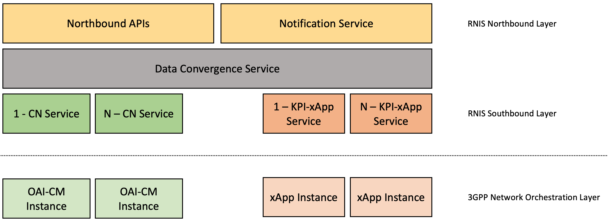

<table style="border-collapse: collapse; border: none;">
  <tr style="border-collapse: collapse; border: none;">
    <td style="border-collapse: collapse; border: none;">
      <a href="http://www.openairinterface.org/">
         
         </img>
      </a>
    </td>
    <td style="border-collapse: collapse; border: none; vertical-align: center;">
      <b><font size = "5">OpenAirInterface Radio Network Information Service (RNIS) </font></b>
    </td>
  </tr>
</table>
 
The Radio Network Information Service (RNIS) is a service provided by the Multi-access Edge Computing Platform to get radio information for a user. This service has been implemented by following Radio Network Information API - ETSI MEC GS 012 and by adapting it to expose Radio Access Network information in a 5G Standalone implementation.

**TABLE OF CONTENTS**

1.  [Architecture](#1-rnis-xapp)
2.  [Working](#2-working)
3.  [How to Install](#3-how-to-install)
4.  [How to Contribute](#4-how-to-contribute)
5.  [Leave a Feeback or Ask Questions](#5-leave-a-feedback-or-ask-questions)
6.  [Authors](#6-authors)


## 1. Architecture

The service is based on some different modules called rnisApp or rnisService which are:

1. **Northbound API**: OpenApi Standard interface (ETSI GS MEC 012) which exposes Radio Network Information API and allows Edge Apps to subscribe to radio information.
2. **Data Convergence Service**: Is a repository in which all the network information converges and is processed. Also changes on data will trigger a notification to the Notification Service that will deliver it to the subscribed apps.
3. **Notification Service**: Receives notification on network information changes from a data repository and notifies the subscribed apps about the event
4. **Core Network Wrapper Service**: Represent a Core Network abstraction
5. **KPIs-xApp Service**: It allows the RNIS to interface with the northbound interface of a RAN xApp which provides users’ KPIs
This first picture shows a general architecture of the Radio Network Information Service, highlighting the differnte modules explained in the previous table.




### 1.1 Northbound Interface
Reference:
https://forge.etsi.org/rep/mec/gs012-rnis-api/raw/stf606-final/RniAPI.yaml

Swagger UI
https://forge.etsi.org/swagger/ui/?url=https://forge.etsi.org/rep/mec/gs012-rnis-api/raw/stf606-final/RniAPI.yaml#/

Proposed Interface
https://gitlab.eurecom.fr/eurecom-mec-platform/eurecom-mec-rnis/rnis/swagger/swagger.yaml


### 1.2 Repository Structure

The code is mostly written in Python using flask framework. The [northerbound api](./src/oai_rnis/swagger/swagger.yaml) follows OpenApi 3.0 specification and models are auto-generated using [swagger editor](https://editor.swagger.io/)

```
.
├── ci-scripts
│   ├── conf
│   ├── database
│   └── healthscripts
├── docker
├── docs
│   └── images
├── etc
├── src
│   ├── oai_rnis
│   │   ├── controllers (application logic)
│   │   ├── handlers  (libraries to communicate with other applications)
│   │   ├── models  (models created by openapi defination)
│   │   ├── swagger (openapi defination)
│   │   └── utils
├── xapps

```

## 2. Working

The RNIS main task is to retrieve information from a 3GPP network via **mp2** and expose them to third-party edge applications or other edge services via **mp1**. The communication with the 3GPP Network happens via two different rnisApps: the **Core Network Wrapper Service** and the **KPIs-xApp Service**. These two services are scaled and instantiated according to the number of nodes the RNIS has to communicate with.
The former is a consumer for all the events related to the 5G Core Network which are exposed by the OAI-CM, while the latter consumes information from a specifically-conceived O-RAN xApp that exposes radio-related metrics (see [rnis-xApp](https://gitlab.eurecom.fr/oai/orchestration/oai-mec/oai-rnis/-/blob/develop/xapps/README.md)).
The data retrieved and processed by these modules is sent to the Data Convergence Service, which is responsible for merging all the information and triggering specific events. 
After being processed, the information becomes available both to the **Northbound API** and the **Notification Service** rnisApp. While the Northbound APIs expose the information via a RESTful Interface, the Notification Service is responsibile for communicating the new events to all the interested subscribers through an HTTP-based notification service. 


## 3. How to Install

For users of RNIS we recommend that you use docker containers for running RNIS. It is possible to run without docker containers but that is recommended for developers.

Hardware requirements

1. `avx2` if you are using oai-gNB docker image else you have to build it without `avx2`
2. Minimum 4 CPU and 16 GB RAM, better to have 8 CPU same machine can have core network and ran network functions for testing
3. Docker version > 22

To check for `avx2` flag you can use `lscpu | avx2`

**Note**: In docker version 23 and above compose command is integrated in docker cli. So you can use `docker compose` instead of `docker-compose`

Clone the project

```shell
git clone https://gitlab.eurecom.fr/oai/orchestration/oai-mec/oai-rnis.git
```

### 3.1 Build Container Image (Optional)

It is optional to build the container images, you can pull the images from our official docker hub repository. If you don't pull them in this step. docker compose will do that for you. In case you make any changes in the code you have to re-build the image. You can use the below command


```shell
docker build -t oai-rnis:latest -f docker/Dockerfile.rnis.alpine --no-cache .
```

### 3.2 Start RNIS and its Dependencies

You can use our ci docker-compose which we use for testing of the RNIS. To test the RNIS you need a working core-network setup and RAN (gNB) connected to FlexRIC and xApp. 

#### 3.2.1 Start the oai core-network (version v1.5.0)

```shell
docker-compose -f ci-scripts/docker-compose-core-network.yaml up -d
```

To check if the contianers are healthy 

```shell
docker-compose -f ci-scripts/docker-compose-core-network.yaml ps -a
```

#### 3.2.2 Start flexric version 1.0.0, oai-gnb and rabbitmq

oai-gnb branch is mep-compatible. It is based on the gNB tag 2022.41 which is compatible with flexric version 1.0.0. If you want to build the xApp container then follow this [guide](.xapps/README.md)

```shell
docker-compose -f ci-scripts/docker-compose-ran.yaml up -d oai-gnb oai-flexric rabbitmq
```

To check if the contianers are healthy 

```shell
docker-compose -f ci-scripts/docker-compose-ran.yaml ps -a
```

#### 3.2.3 Start RNIS xApp containers,

Make sure all the previous containers are healthy in case flexric is not healthy you can not move forward. 

```shell
docker-compose -f ci-scripts/docker-compose-ran.yaml up -d oai-rnis-xapp
```

To verify that everything is done correctly so far, login to RabbitMq management console http://192.168.70.166:15672/#/queues to see that message queue `rnis_xapp` has been created. If the queue has been created then please move forward. 

#### 3.2.4 Start RNIS, OAI-CM (Configuration Manager) and its database.

```shell
docker-compose -f ci-scripts/docker-compose.yaml up -d oai-cm mongodb
```

Check if the containers are healthy

```shell
docker-compose -f ci-scripts/docker-compose.yaml ps -a
```
Once they are healthy you can start rnis container

```shell
docker-compose -f ci-scripts/docker-compose.yaml up -d oai-rnis
```

You can access RNIS swagger --> http://192.168.70.169/v2/ui/#

#### 3.2.5 Testing

Start the UE and you will start seeing messages in the rabbitmq queue and you can get message from rnis swagger api --> http://192.168.70.169/v2/ui/#

```shell
docker-compose -f ci-scripts/docker-compose-ran.yaml up -d oai-nr-ue
```

You can perform curl to get messages or subscribe to messages on via POST /subscriptions. To do curl 

```shell
curl -X 'GET' 'http://192.168.70.169/v2/queries/layer2_meas' -H 'accept: application/json'
```

#### 3.2.6 Remove Everything

```shell
docker-compose -f ci-scripts/docker-compose-ran.yaml down -t2
docker-compose -f ci-scripts/docker-compose-core-network.yaml down -t2
docker-compose -f ci-scripts/docker-compose.yaml down -t2
```


### 3.3 For developers

If you want to make any changes in rnis you can install the service using below commands

Pre-requisite: python +3.8, virtualenv(optional) 

**Note**: Only tested in linux at the moment

Clone the project

```shell
git clone https://gitlab.eurecom.fr/oai/orchestration/oai-mec/oai-rnis.git
```

**Optional**: If you want to create an environment for testing then you can use `virtualenv` or `pyenv`. Here is an example with virtualenv to create a virtual python environment for testing/development. 

```shell
cd oai-rnis
apt-get install virtualenv
virtualenv -p python3 venv
# to start the virtual environment
source venv/bin/activate
# to get out of the environment 
deactivate
```

Installing and starting the RNIS,

```shell
cd oai-rnis/src
pip install .
#if you want to edit the code while running you can use -e
pip install -e .
```

The config parameters are written in [configuration.yaml](./etc/configuration.yaml). The file is python jinja2 template. At the runtime parameters are fetched from environment variable to create the file. You can set the parameters as environment variables or fill the information in the configuration file and set the environment variable `MOUNT_CONFIG` to `yes`. You can find a sample [configuration.yaml](./etc/configuration.sample.yaml) is in `./etc` repository. 


Before we start the RNIS we need 
1. Running instance of oai-core-network follow section 3.2.1
2. An instance of oai-gNB, connected to FlexRIC, xApp and RabbitMQ follow section 3.2.2
3. Running instance of the core network manager (`oai-cm`) to get event notifications follow section 3.2.3

Start `oai-cm`

```shell
docker-compose -f ci-scripts/docker-compose.yaml up -d mongodb oai-cm
```

To start the RNIS

```shell
#currrent directory is oai-rnis/
#set the configuration file to etc/configuration.sample.yaml, you need to set the full path
export CONFIG_FILE=<your-parent-directory>/etc/configuration.sample.yaml
export MOUNT_CONFIG=yes
oai_rnis
```

The swagger ui can be access via http://192.168.70.1:8080/v2/ui/# (if the port is 8080 else whatevert port on which you are running `oai_rnis` process)

## 4. How to Contribute

You want to contribute we would love to have you on-board, 

Please refer to the steps described on our website: [How to contribute to OAI](https://www.openairinterface.org/?page_id=112)

1. Sign and return a Contributor License Agreement to OAI team.
2. Create an account on [Eurecom GiLab Server](https://gitlab.eurecom.fr/users/sign_in) if you do not have any.
   - If your email domain (`@domain.com`) is not whitelisted, please contact us (mailto:contact@openairinterface.org).
   - Eurecom GitLab does NOT accept public email domains.
3. Provide the `username` of this account to the OAI team (mailto:contact@openairinterface.org) so you have developer rights on this repository.
4. The policies are described in these wiki pages: [OAI Policies](https://gitlab.eurecom.fr/oai/openairinterface5g/wikis/oai-policies-home)
   - You can fork onto another hosting system. But we will **NOT** accept a pull request from a forked repository.
      * The Continuous Integration will reject your pull request.
   - All pull requests SHALL have **`master`** branch as target branch.

## 5. Leave a Feedback or Ask Questions

If you have questions or want to leave a feedback feel free to send us an email at `netsoft@eurecom.fr`


## 6. Authors

```
Mohamed MEKKI
Karim BOUTIBA
Giulio CAROTA
Adlen KSENTINI
Stefano ROSSATO
Abderrahmen TLILI
Sagar ARORA
```